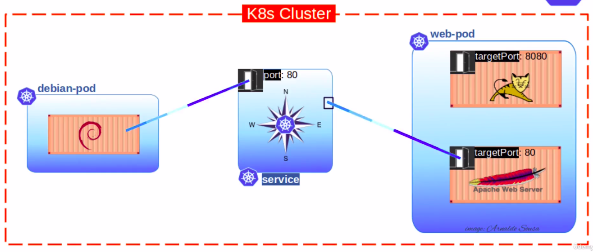
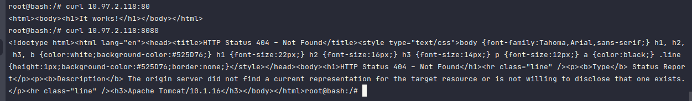

## 🔗 ClusterIP

- It is used for internal cluster communication
- We can have many Namespaces and establish a communication between Pods using ClusterIP Service
- ClusterIP doesnt not provide a ExternalIP for external access

## Usecase 

We are going to create a simple use case using two containers in the same **Pod**, a **ClusterIP service** and a **Debian Pod**

## 🧪 Testing

1. Create a Pod and a Service using the `my-pod.yaml` and `my-service.yaml`
2. Create a debian pod using CLI way: `kubectl run -it --image=debian bash`
3. Inside debian container, run the following command: `apt update && apt install curl -y`
4. After curl was installed, you can test if the **Tomcat Pod** and **Apache Pod** is accessible
5. To test run: `curl [CLUSTER-IP]:[container-port]`
    - `curl 10.97.2.118:80`
    - `curl 10.97.2.118:8080`
    - You should see these responses
   

Note: With the `kubectl get services` you can get the Service's Cluster-IP.
   
